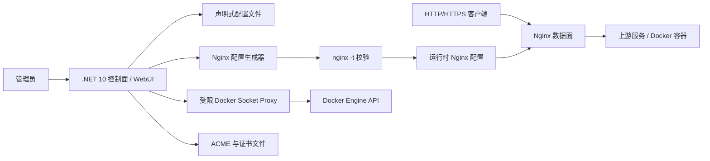

# NCPM（.NET Nginx Container & Proxy Management Panel）

> A lightweight container & reverse proxy management panel.

> 状态说明（2026-08-13）：本文保留早期范围分析和参考项目取舍。当前实现已超出首版范围，包含 TCP/UDP、Compose、Docker Label、DNS-01/通配符、多节点 HTTPS/mTLS、通知和回滚；实际能力、部署方式与上线门禁以 `README.md`、`AGENTS.md` 和 `docs/PRODUCTION-CHECKLIST.md` 为准。OIDC 仍仅为配置草稿。

当前仓库已完成 MVP 开发，正式名称为 NCPM。

## 项目定位

本项目面向个人服务器、家庭实验室和小型自托管环境，希望通过一个简单的 Web 界面完成三类高频工作：

1. 将域名或路径反向代理到本机、局域网或 Docker 服务；
2. 自动申请、续期和加载 HTTPS 证书；
3. 查看并执行常用的 Docker 容器运维操作。

首要目标是易部署、低资源占用和可恢复性。初期采用单节点、单实例设计，以配置文件作为事实来源；.NET 主要负责 WebUI、配置管理、任务编排和状态展示，实际流量交由 Nginx 等成熟原生工具处理。不以集群、编排平台或企业级多租户为目标。

## 核心原则

- **开箱可用**：单个 Docker Compose 文件即可启动，数据目录可直接备份和迁移。
- **代理链路稳定**：管理界面停止或重启时，已经加载到 Nginx 的代理路由仍然继续工作。
- **配置文件优先**：用户配置采用可读、可备份、可版本管理的文件；数据库尽量不用，确有必要时也只存非关键辅助状态。
- **安全默认值**：默认启用身份认证、操作审计、HTTPS 跳转，并尽量缩小 Docker API 权限。
- **配置可追溯**：路由、证书和容器操作均保留状态、错误原因与审计记录。
- **渐进增强**：先做好 HTTP/HTTPS、SSL 和常用容器管理，再扩展自动发现、DNS-01、多节点等能力。

## 首版范围（MVP）

### 1. 反向代理

- 按域名匹配 HTTP/HTTPS 请求；
- 配置一个或多个上游地址；
- 支持 WebSocket、SSE、gRPC 等流式转发能力；
- HTTP 自动跳转 HTTPS；
- 常用请求头处理：`X-Forwarded-*`、`Host`、真实客户端 IP；
- 上游 TLS 校验开关、连接/响应超时配置；
- 路由启用、停用、修改和即时生效；
- 基础健康检查与代理错误状态展示；
- 基础访问日志，可按路由查看近期记录。

首版不实现 TCP/UDP 转发、复杂规则 DSL、插件式中间件和高级负载均衡策略。

### 2. SSL 证书

- 导入已有 PEM/PFX 证书；
- 通过 ACME 自动申请和续期证书；
- 首版优先支持 HTTP-01；
- 展示证书域名、颁发者、有效期和最近续期结果；
- 证书更新后无中断加载；
- 续期失败重试与面板告警。

DNS-01 和泛域名证书列入第二阶段。DNS-01 需要按 DNS 服务商安全保存 API 凭据，扩展成本和安全风险都高于 HTTP-01。

### 3. Docker 管理

- 查看容器列表、状态、镜像、端口和基础详情；
- 启动、停止和重启容器；
- 实时查看容器日志；
- 查看 CPU、内存、网络等实时指标；
- 监听 Docker Events，及时更新面板状态；
- 允许将代理路由关联到容器，辅助填写上游地址。

首版明确不提供容器内终端、任意命令执行、镜像构建、Registry 管理、Volume 文件管理、Docker Swarm/Kubernetes 或完整 Compose 编排。这些能力会显著扩大攻击面，也容易让项目偏离核心定位。

## 参考项目分析

主要参考项目：`E:\code-third-repos\100-Temp\godoxy`

GoDoxy 是一个带 WebUI 的轻量级反向代理。其整体思路值得借鉴：

- 从 Docker 容器与标签发现代理路由；
- 监听容器和配置变化并热更新；
- 统一管理路由、证书、日志、指标和容器生命周期；
- 支持本地与多个远程 Docker 节点；
- 使用独立的 socket proxy 限制暴露的 Docker API；
- 将 WebUI 作为静态资源嵌入服务端，简化部署。

它已经覆盖的范围很广，包括 HTTP 反代、TCP/UDP 转发、DNS-01、访问控制、OIDC、ForwardAuth、负载均衡、空闲容器休眠、Proxmox 和通知等。本项目不会逐项复刻，而是借鉴其产品闭环和安全设计。

### 值得直接吸收的经验

1. **Docker 管理必须最小授权**：参考项目通过 socket proxy 仅开放查询、事件、启停和重启等必要接口。
2. **事件驱动优于频繁轮询**：订阅 Docker Events 和配置变更，避免持续全量扫描。
3. **发布配置必须可验证、可回滚**：面板先生成候选配置，通过 `nginx -t` 后才原子替换并 reload；失败时保留上一份可用配置。
4. **证书生命周期是一等能力**：申请、续期、加载、失败冷却、过期告警需要形成完整闭环。
5. **管理面与代理面需要隔离思考**：即使初期运行在同一进程中，也应保持模块边界，避免后台管理故障拖垮代理请求。

### 暂不跟随的能力

- TCP/UDP 与 TLS SNI 透传；
- Proxmox 与远程 Agent；
- OIDC、ForwardAuth、GeoIP 与复杂 ACL；
- 容器空闲休眠与流量唤醒；
- 自定义规则语言和可编排中间件；
- 多节点高可用。

## 建议技术架构



整体采用控制面与数据面分离的思路：

- **数据面**：Nginx 独立容器监听 80/443，处理反代、TLS、WebSocket、超时、Header 和访问日志；
- **控制面**：.NET 10 应用提供 WebUI/API，将用户操作写回声明式配置，并安全地生成和发布 Nginx 配置；
- **状态面**：配置文件和证书目录通过 Docker Volume 持久化，运行状态从 Nginx、Docker 和文件系统实时读取；
- **安装面**：最终通过 Docker Compose 一次启动面板、Nginx 和受限 Docker Socket Proxy。

### 后端

- **.NET 10 / ASP.NET Core**：承载管理 API、认证、配置编辑、后台任务和静态 WebUI；
- **Nginx**：处理实际 HTTP/HTTPS 流量，不在 .NET 进程内自行实现代理；
- **YAML/JSON 配置文件**：保存路由、证书策略、Docker 节点与系统设置；
- **Docker Engine API 客户端**：访问本地 Docker Socket，后续再抽象远程节点；
- **SignalR 或原生 WebSocket**：推送日志、容器指标、事件和任务进度；
- **ACME 客户端库**：处理账号、挑战、签发和续期，具体库在原型验证后确定；
- **OpenAPI**：维护前后端接口契约。

面板维护的声明式配置不能直接当作 Nginx 配置拼接。应通过强类型模型完成解析和校验，再由固定模板生成候选文件，执行 `nginx -t` 检查语法及引用文件，成功后原子替换运行配置并向 Nginx 发送 HUP/reload。Nginx 会启动新 worker 并优雅关闭旧 worker，因此管理面板无需进入代理请求热路径。

不建议首版同时引入 YARP。未来只有在需要 .NET 内部代理管理 API、特殊认证回调或 Nginx 难以表达的控制面能力时，再将 YARP 作为局部组件评估，而不是主代理引擎。

### 前端

前端确定采用 **Blazor Web App（Interactive Server）+ Ant Design Blazor + AntDesign.ProLayout**，参考 `E:\code-repos\apiext-fs-antd` 的实现方式：

- 使用 `AntDesign` 提供表格、表单、抽屉、弹窗、统计、告警和反馈组件；
- 使用 `AntDesign.ProLayout` 的 `BasicLayout` 作为后台主框架；
- 使用 `MenuDataItem` 构建按权限和运行能力生成的侧边菜单；
- 使用 `PageContainer` 统一页面标题、面包屑、说明和操作区；
- 使用 `HeaderContentRender` 提供侧边栏折叠，`RightContentRender` 放置全局状态、主题和管理员菜单；
- 登录、首次安装和故障恢复页面使用独立的轻量布局，不显示后台侧边栏；
- 前后端共用 .NET 类型和校验逻辑，不额外维护 Node.js SPA 工程或独立前端服务。

生产构建由 ASP.NET Core 托管 Blazor 与静态资源，保持单个面板镜像。部署时浏览器只连接 `panel` 控制面，公网代理流量仍直接进入 Nginx。

### 后台信息架构

建议的一级菜单：

| 菜单 | 主要内容 |
| --- | --- |
| 概览 | Nginx、Docker、证书和配置 revision 的整体状态 |
| 代理主机 | 域名、上游、HTTPS、Header、超时、访问日志配置 |
| 证书 | 证书有效期、ACME 策略、签发与续期记录 |
| 容器 | 容器列表、详情、启停、重启、日志和实时指标 |
| 配置发布 | 候选 revision、`nginx -t` 结果、发布历史和回滚 |
| 审计日志 | 登录、配置、证书和 Docker 操作记录 |
| 系统设置 | 面板、安全、存储、Docker Endpoint 和备份策略 |

### 视觉方向

Ant Design 负责一致的交互基础，但界面不直接停留在默认模板外观。整体定位为“服务器运行控制台”：

- 使用冷灰蓝作为基础色，成功、警告和故障颜色只表达真实运行状态；
- 桌面端保持适度紧凑，优先展示域名、证书到期时间、容器状态等运维信息；
- 移动端将宽表格切换为摘要列表或抽屉详情，关键操作保持可触达；
- 全局保留一条简洁的“发布状态栏”，持续显示当前 revision、Nginx 配置校验结果以及是否存在未发布变更；
- 动效只用于配置发布、日志连接和状态切换等需要说明过程的场景，并支持 reduced motion；
- 所有操作具备键盘焦点、明确 loading、空状态、错误原因和恢复入口。

参考项目中的 `SettingDrawer` 更适合开发调试，正式生产界面默认不展示；可配置主题应收敛到系统设置，避免用户误触布局实验项。

### 解决方案结构

采用单体应用结构，简化开发和部署：

```text
src/
  Ncpm.Web/                # 单体应用，包含所有功能
    Services/              # 业务服务层（Config、Docker、Nginx、Auth等）
    Pages/                 # Blazor 页面（Dashboard、Proxy、Docker、Certificates等）
    Layouts/               # 布局组件
    wwwroot/               # 静态资源
    Program.cs             # 入口和依赖注入配置
deploy/
  Dockerfile
  nginx.conf
  default.conf
  data/                    # 持久化数据目录
docker-compose.yml
Ncpm.slnx                  # 解决方案文件
```

MVP 阶段保持单体结构，降低复杂度。后续如需拆分，可按职责分离为独立项目。

## 配置与状态存储

### 配置文件是唯一事实来源

建议将用户可管理配置拆分为多个小文件，避免所有内容集中在一个大文件中：

```text
data/
  config/
    panel.yml              # 面板监听、认证策略、全局默认值
    proxy-hosts/           # 每个代理主机一个 YAML 文件
      app.example.com.yml
    docker-endpoints/      # Docker 节点配置
      local.yml
    certificate-policies/  # ACME 与证书绑定策略，不存明文密钥
      example.com.yml
  nginx/
    generated/             # 面板生成的候选配置
    active/                # 当前已验证并发布的配置
  revisions/               # 声明式配置与生成配置的版本快照，用于回滚
  certs/                   # 证书、私钥和 ACME 账号文件
  secrets/                 # 权限受限的敏感信息文件
  logs/                    # 面板、Nginx 访问及错误日志
  audit/                   # 追加写审计日志
  backups/
```

配置写入采用“临时文件 → flush → 原子 rename”的方式，并为每次变更生成 revision。只有验证通过的 revision 才能晋升为当前配置。面板启动时只读取这些文件恢复状态，用户也可以在面板停止后人工备份、审查或迁移配置。

代理主机配置示例（字段仍待原型确认）：

```yaml
schemaVersion: 1
id: app-example-com
enabled: true
hosts:
  - app.example.com
upstreams:
  - url: http://app:8080
tls:
  mode: acme
  certificatePolicy: example-com
http:
  redirectToHttps: true
  websocket: true
  preserveHost: true
  connectTimeout: 10s
  responseTimeout: 60s
logging:
  accessLog: true
```

配置边界约定：

- `data/config/` 是用户配置，可由 WebUI 或人工编辑；
- `data/nginx/generated/` 和 `active/` 完全由面板管理，不允许人工修改；
- 每个配置文件必须包含 `schemaVersion` 和稳定 `id`，升级时可做显式迁移；
- 面板监视人工修改，只有完整解析和校验成功才发布；
- 同一时刻只允许一个配置发布任务，并使用文件锁避免并发覆盖；
- 环境变量只用于启动引导和路径覆盖，不作为大量业务配置的第二来源。

### 数据库策略

MVP 默认不引入 SQLite 和 EF Core。以下数据分别处理：

- 路由、证书策略、Docker 节点和系统设置：YAML/JSON；
- 管理员凭据：权限受限的认证文件或 ASP.NET Core Data Protection 保护的文件；
- 证书私钥与 Token：独立 secrets 文件，绝不写进普通配置或日志；
- 审计记录：JSON Lines 追加文件并按大小/日期轮转；
- Nginx 访问日志：滚动日志文件；
- Docker 指标：实时读取，MVP 不做长期持久化；
- 临时任务状态：内存中维护，必要时用小型 JSON 状态文件恢复。

只有当后续出现配置文件明显不适合的问题，例如大量用户与复杂查询、分布式锁或高频关系数据，才重新评估 SQLite。即使引入，核心代理配置仍以文件为准，保证脱离面板后可读、可恢复。

## 关键运行流程

### 路由变更

1. 用户在 WebUI 保存配置；
2. 服务端执行域名、目标地址、冲突和权限校验；
3. 在隔离目录写入新的声明式配置 revision，暂不覆盖当前配置；
4. 从候选 revision 生成一套隔离的 Nginx 候选配置；
5. 执行 `nginx -t`，同时检查证书、引用文件和端口冲突；
6. 校验成功后原子晋升声明式配置和 `active` Nginx 配置，追加审计记录并 reload；
7. 若校验失败则丢弃候选；若 reload 失败则恢复上一 revision，并在 WebUI 展示完整错误。

### 证书续期

1. 后台任务定期扫描即将过期的证书；
2. 创建 ACME order 并完成 challenge；
3. 将新证书写入临时文件并验证证书链、私钥和域名；
4. 原子替换证书文件，执行 `nginx -t` 后 reload；
5. 记录结果；失败时按退避策略重试，避免触发 CA 限流。

### Docker 状态同步

1. 启动时全量读取容器；
2. 持续订阅 Docker Events；
3. 将事件转换为内部状态更新并推送到 WebUI；
4. 断线后重连并再次全量校准，避免漏事件。

## 安全基线

Docker Socket 通常等同于宿主机高权限入口，是本项目最大的安全边界之一。

- 默认仅支持本地 Unix Socket，不暴露无 TLS 的 TCP Docker API；
- 生产部署优先通过受限 socket proxy，仅开放实际使用的 API；
- 管理面板必须认证，首次启动引导创建管理员，禁止内置默认密码；
- 密码使用 ASP.NET Core Identity 的安全哈希机制；
- DNS API Token、ACME 账号密钥、远程 Docker 凭据等敏感信息不能明文展示或写入日志；
- 私钥使用权限受限的独立文件保存，普通配置中只记录文件引用和非敏感元数据；
- 登录、配置变更、证书操作和容器启停均写入审计日志；
- 对登录与高风险 API 增加限流、CSRF 防护和重新认证策略；
- 默认不提供容器 `exec`，避免面板直接成为宿主机终端入口；
- 容器镜像以非 root 用户运行；监听 80/443 所需权限单独配置，不授予多余 capabilities。

## 部署设想

首版目标平台：Linux AMD64 / ARM64，最终交付方式为 Docker Compose。用户不需要在宿主机安装 .NET 或 Nginx，只需要 Docker Engine 和 Docker Compose。

建议的容器拓扑：

| 服务 | 职责 | 对外端口 |
| --- | --- | --- |
| `panel` | .NET WebUI、API、配置生成、ACME 与任务调度 | 管理端口，默认仅内网访问 |
| `nginx` | 唯一的公网数据面，读取只读的 active 配置和证书 | `80`、`443` |
| `socket-proxy` | 在面板和 Docker Socket 之间限制可调用 API | 不对公网暴露 |

面板和 Nginx 共享配置与证书 Volume。`panel` 对生成目录有写权限，`nginx` 原则上只读；面板通过受控方式触发配置校验与 reload。具体采用共享 PID namespace、Docker API signal，还是一个极小的本地控制端点，需要在 Phase 0 用最小权限原则验证。

目标安装体验：下载发行版提供的 `compose.yml` 与 `.env`，完成少量端口和数据目录设置后执行：

```shell
docker compose up -d
```

升级应通过拉取新镜像并重新创建容器完成，持久化配置和证书不随容器删除。启动前自动备份配置，升级失败时应能回退镜像与配置 revision。

建议持久化目录：

```text
data/
  config/
  nginx/
  revisions/
  certs/
  secrets/
  logs/
  audit/
  backups/
```

需要在原型阶段验证两种上游连接方式：

1. 使用宿主机已发布端口作为上游，行为最容易理解；
2. 面板加入共享 Docker 网络并按容器 DNS 名称访问，配置更简洁但网络与权限管理更复杂。

首版不承诺 Windows 容器、裸机安装或 Kubernetes 部署。

## 分阶段路线图

### Phase 0：技术原型

- [ ] 建立 .NET 10 解决方案与测试工程；
- [ ] 验证声明式配置到 Nginx 配置的生成、`nginx -t`、原子发布和回滚；
- [ ] 验证 Nginx graceful reload 期间长连接、WebSocket 和 HTTPS 请求不中断；
- [ ] 验证证书文件更新与多域名 SNI 配置；
- [ ] 验证 Docker Socket、Events、日志和 Stats 流；
- [ ] 验证 panel、nginx、socket-proxy 三容器的最小权限通信方式；
- [ ] 建立 Blazor Interactive Server、AntDesign 和 ProLayout 后台骨架；
- [ ] 完成概览、代理主机和容器页面的响应式 UI 原型；
- [ ] 完成威胁模型和部署网络方案。

### Phase 1：MVP

- [ ] 首次启动、管理员登录和系统设置；
- [ ] 代理主机 CRUD、配置文件持久化、校验、发布与回滚；
- [ ] 手动证书导入与 HTTP-01 自动证书；
- [ ] 容器列表、详情、启停、重启、日志和指标；
- [ ] 仪表盘、错误状态、基础访问日志和审计日志；
- [ ] Docker Compose、数据备份与升级迁移文档；
- [ ] 单元、集成和关键端到端测试。

### Phase 2：增强

- [ ] Docker Label 自动发现路由；
- [ ] DNS-01、泛域名和多证书；
- [ ] 多上游、健康检查和负载均衡；
- [ ] 远程 Docker 节点（SSH/TLS 或受控 Agent）；
- [ ] 访问控制、通知和备份恢复界面；
- [ ] 可选的双因素认证。

### Future：评估后决定

- [ ] TCP/UDP 代理和 TLS Passthrough；
- [ ] Compose 项目管理；
- [ ] OIDC / ForwardAuth；
- [ ] 多实例与高可用；
- [ ] 插件或扩展机制。

## 尚待确认的产品决策

- ~~正式项目名称、Logo、域名和 NuGet/镜像命名空间；~~ （已确定：NCPM）
- MVP 是否只支持单管理员，还是直接设计多用户与角色；
- ACME 首版仅支持 Let's Encrypt，还是允许自定义 CA Directory；
- 面板触发 Nginx 校验和 reload 的最小权限实现方式；
- YAML 配置是否允许用户直接编辑，还是只保证可读和可导入导出；
- Docker 上游默认使用宿主机端口还是共享网络；
- 访问日志的保留周期、存储格式和隐私策略；
- 是否在 MVP 提供内置备份与恢复。

## 命名

正式名称：**NCPM**（.NET Nginx Container & Proxy Management Panel）

描述：A lightweight container & reverse proxy management panel.

## 参考资料

- 本地参考实现：`E:\code-third-repos\100-Temp\godoxy`
- 后台 UI 参考实现：`E:\code-repos\apiext-fs-antd`
- [Nginx 反向代理模块](https://nginx.org/en/docs/http/ngx_http_proxy_module.html)
- [Nginx 配置校验命令](https://nginx.org/en/docs/switches.html)
- [Nginx 配置 reload 机制](https://nginx.org/en/docs/control.html)
- [NGINX Docker 部署文档](https://docs.nginx.com/nginx/admin-guide/installing-nginx/installing-nginx-docker/)
- [Docker Compose 文档](https://docs.docker.com/compose/)
- [Docker daemon socket 安全建议](https://docs.docker.com/engine/security/protect-access/)
- [Let's Encrypt Challenge Types](https://letsencrypt.org/docs/challenge-types/)

## License

项目许可证尚未确定。参考项目 GoDoxy 使用 MIT License，而 `apiext-fs-antd` 使用 AGPL-3.0。后者仅作为技术结构和交互方式参考，不直接复制其源码；UI 实现应基于 AntDesign 与 AntDesign.ProLayout 的公开 API 独立完成。正式引入或改写任何第三方代码前，仍需逐项确认许可证并保留版权声明。本 README 目前仅记录分析结论与原创设计方案。
